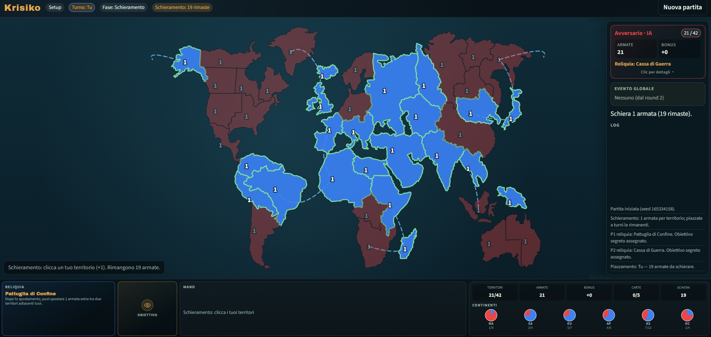

# Krisiko

Prototipo browser: **Risiko + reliquie + carte + eventi globali**. Demo: 1 giocatore vs IA.

> **Metodo di lavoro:** [docs/repo-org.md](docs/repo-org.md).  
> Questo README è l’**istanza** (`aedral/krisiko`, chart `krisiko`). Per replicare layout, Docker, Helm, CI o Pages su un altro progetto, segui il playbook, non copiare i nomi da qui.



## Valori

| Chiave | Valore |
|--------|--------|
| owner / repo / app | `aedral` / `krisiko` / `krisiko` |
| Immagine | `ghcr.io/aedral/krisiko` |
| Chart | `oci://ghcr.io/aedral/krisiko/krisiko` |
| Pages | https://aedral.github.io/krisiko/ |
| Compose | http://localhost:3080 |
| Serve | http://localhost:3000 |

## Avvio

```bash
docker compose up --build
```

Senza Docker:

```bash
npm start
```

## Test

```bash
npm run smoke
```

Partite headless IA vs IA (`src/js/smoke-test.js`). Non entra nell’immagine (`.dockerignore`).

## Release

I commit su `main` non pubblicano. Si pubblica con un tag SemVer:

```bash
git tag v0.1.0
git push origin v0.1.0
```

Il workflow `.github/workflows/release.yml` (tag `v*`) nell’ordine:

1. immagine Docker su GHCR (`:v0.1.0`, `:0.1.0`, `:latest`)
2. chart Helm OCI su GHCR
3. contenuto di `src/` su GitHub Pages (ultima release)

```bash
helm install krisiko oci://ghcr.io/aedral/krisiko/krisiko --version 0.1.0
```

## Pages

Demo = ultima release, non `main`.

Se il job fallisce con *Get Pages site failed*: **Settings → Pages → Source: GitHub Actions**, poi re-run del workflow (o un nuovo tag). Comandi `gh` e checklist: playbook, [sezione 8](docs/repo-org.md#8-github-pages--setup-una-tantum).

## Albero

```
src/                 runtime (HTML/CSS/JS, path relativi)
  js/engine/         regole, stato serializzabile
  js/ai/             IA euristica
  js/ui/             mappa, HUD, dadi
  js/data/           territori, carte, reliquie, eventi, missioni
helm/krisiko/        chart Kubernetes
.github/workflows/   release su tag v*
docs/                playbook, GDD, catalogo, asset
Dockerfile           nginx serve src/
docker-compose.yml   host 3080 → container 80
```

`src/` è l’unico artefatto runtime: Compose, immagine e Pages servono quella cartella.

## Prodotto

Si vince completando l’**obiettivo segreto** (missione), oppure eliminando l’avversario. Eventi globali dalla fine del round 2.

Controlli:

1. **Rinforzi** — click sui propri territori, poi «Fine rinforzi»
2. **Attacco** — attaccante (≥2 armate) poi nemico adiacente; carta combat opzionale dalla mano
3. **Spostamento** — da → a (un movimento)
4. **Carte azione** — click sulla carta, poi il bersaglio richiesto

Layout: mappa al centro, pannello avversario a destra, reliquia + mano + stats in basso.

Mappa basata sul tabellone Risk (Wikimedia / CC BY-SA).

## Documenti

| File | Contenuto |
|------|-----------|
| [docs/repo-org.md](docs/repo-org.md) | Metodo: albero, Docker, Helm, CI, ignore, Pages |
| [docs/GDD.md](docs/GDD.md) | Regolamento e delta Krisiko |
| [docs/CARTE-RELIQUIE-EVENTI.md](docs/CARTE-RELIQUIE-EVENTI.md) | Catalogo carte, reliquie, eventi |
