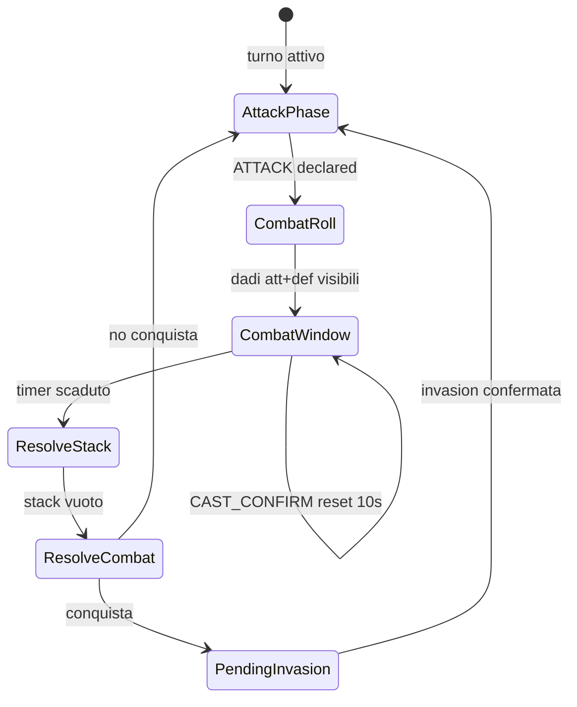
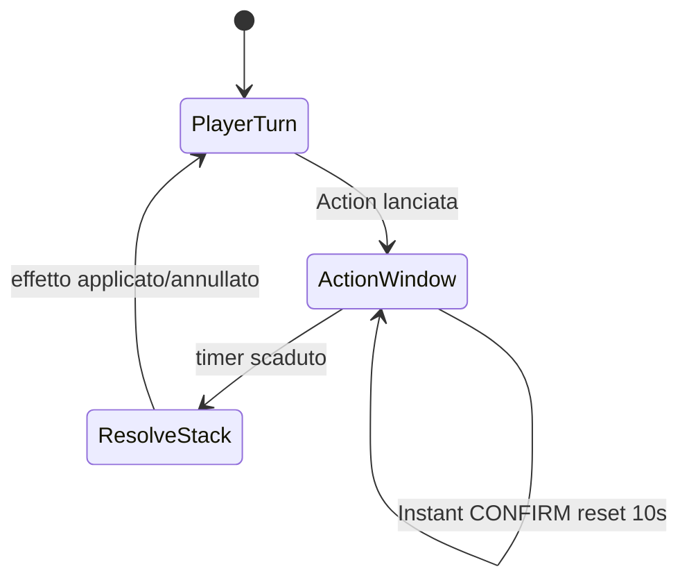

# Krisiko — Stack, carte e combattimento

Specifica di design per la modalità **Krisiko** (non applicabile alla modalità **Classico**).

---

## 1. Panoramica

Sistema a **stack LIFO** visibile a tutti i giocatori. Le carte si risolvono dalla cima verso il basso dopo una finestra di risposta sincrona da **10 secondi**.

### Tipi di carta

| Tipo | Quando si può giocare |
|------|------------------------|
| **Action** | Solo il giocatore di turno, in qualsiasi fase del proprio turno **tranne** durante il combattimento |
| **Combat** | Solo i due giocatori coinvolti nel combattimento, nella finestra post-lancio dadi |
| **Instant** | In risposta, durante le finestre da 10s (fuori combat e in combat) |

### Regole generali stack

- **Counter** solo sulla **cima** dello stack
- Carta counterata → **scartata** (discard)
- Si può **counterare un counter**
- Action con bersaglio già scelto, se counterata → **effetto annullato** (es. niente armate extra)
- **Nessun sistema di priorità** stile Magic (niente turnazione giocatore per giocatore)
- Timer **sincrono per tutti**: 10 secondi totali, non 10s × giocatore

---

## 2. Anti race condition — Cast a due step

Ogni lancio di **Instant** o **Combat** usa conferma obbligatoria:

```
1. Clic "Lancia"     → pendingCast (timer in pausa)
2. UI mostra         → "Marco sta lanciando…" (visibile a tutti)
3. Conferma          → carta sullo stack, timer reset a 10s
   Annulla           → pendingCast rimosso, timer riprende
```

- Un solo **`pendingCast` globale** alla volta (Combat o Instant)
- Ordine sullo stack = ordine di **conferma** (LIFO alla risoluzione)
- Il giocatore di turno **non** può lanciare Instant in risposta alle **proprie** Action

---

## 3. Timer (10 secondi)

| Proprietà | Regola |
|-----------|--------|
| Durata | 10 secondi sincroni per tutti |
| Reset | Ogni `CAST_CONFIRM` che aggiunge allo stack → `deadline = now + 10s` |
| Pausa | Durante `pendingCast` → timer congelato |
| Scadenza | Auto-pass: nessuna nuova carta, si procede a risoluzione |
| Autorità online | Server o host (timestamp assoluto nello state) |
| RNG | **Indipendente** dal timer; deterministico su seed + sequenza azioni |

### State suggerito

```js
window: {
  kind: 'action_response' | 'combat',
  deadlineMs: number,        // timestamp assoluto
  paused: boolean,
  remainingMs?: number,      // se paused
}

pendingCast: {
  playerId: string,
  cardId: string,
  handIndex: number,
  kind: 'instant' | 'combat',
} | null

stack: StackEntry[]         // cima = ultimo elemento
```

---

## 4. Fuori dal combattimento

### Flusso

```
Giocatore di turno (P1) lancia Action (+ bersaglio se richiesto)
  → carta sullo stack
  → window 10s (action_response)

Durante la window:
  - P2…Pn possono lanciare Instant (confirm)
  - P1 NON può Instant sulla propria Action

Timer scade / nessun pendingCast:
  → risolvi stack LIFO
  → effetti applicati o annullati
  → stack vuoto, window chiusa

P1 continua il turno
```

### Restrizioni

- **Action non giocabili durante il combattimento**
- **`END_PHASE` bloccato** se `stack.length > 0` o `window != null`
- Dopo conquista: stack chiuso → **`pendingInvasion`** (modal spostamento armate) → **niente Instant** durante quella scelta

---

## 5. Combattimento

### Flusso

```
1. DICHIARAZIONE
   P1 (turno attivo) dichiara ATTACK: from → to

2. LANCI DADI
   Dadi attaccante + difensore insieme, visibili a tutti
   Snapshot salvato: { attDice, defDice, from, to, attackerId, defenderId }

3. FINESTRA RISPOSTA (10s sync, reset ad ogni confirm)
   Attaccante + difensore: carte Combat (confirm)
   Tutti i giocatori: Instant (confirm)
   pendingCast globale per Combat e Instant

4. CHIUSURA FINESTRA
   Timer scaduto, pendingCast == null
   → risolvi stack LIFO
   → risolvi combattimento (automatico)
   → controllo torna a P1 (fase attacco)

5. P1 può:
   - attaccare di nuovo
   - END_PHASE (se stack vuoto, window null, no pendingInvasion)
```

> **Nota:** il difensore **non** prende il turno. Dopo il combattimento la parola torna al giocatore che sta giocando il turno (P1), salvo `pendingInvasion`.

### Risoluzione combattimento (motore)

Dopo chiusura window e risoluzione stack:

```
1. Applica effetti Combat pre_compare
   (es. +1 dado attacco, -1 dado difesa)

2. Confronto dadi → attLoss, defLoss

3. Applica effetti Combat post_compare
   (es. reroll_attack: rilancia un dado, ricalcola confronto)

4. Applica perdite armate

5. Se conquista → pendingInvasion (stack chiuso, no Instant)

6. Fine — P1 in fase attacco
```

Le carte Combat hanno metadata interno `timing: 'pre_compare' | 'post_compare'`.  
Per il giocatore sono tutte uguali: una finestra, confirm, stack, risoluzione.

### `reroll_attack`

- Tipo: **Combat**
- Timing: **`post_compare`**
- **Nessuna seconda finestra** dedicata
- Si risolve come ogni altra Combat quando lo stack viene processato

---

## 6. Stack — struttura entry

```js
StackEntry: {
  id: string,              // uuid sequenziale
  playerId: string,
  cardId: string,
  kind: 'action' | 'combat' | 'instant',
  targets?: {              // bersagli già scelti al lancio
    territoryId?: string,
    from?: string,
    to?: string,
  },
  status: 'pending' | 'resolved' | 'countered',
}
```

### Risoluzione LIFO

```
while (stack.length > 0) {
  entry = stack.pop()
  if (entry è counter) {
    countera cima rimanente → discard
  } else {
    applica effetto entry (o annulla se counterata)
  }
}
```

---

## 7. Counter — regole

| Domanda | Risposta |
|---------|----------|
| Cosa si può counterare? | Solo la **cima** dello stack |
| Dove va la carta counterata? | **Discard** |
| Si può counterare un counter? | **Sì** |
| Action con territorio scelto, counterata? | Effetto **non** si applica; niente armate extra |

---

## 8. Cosa blocca il turno

| Stato | Comportamento |
|-------|---------------|
| `window != null` | Finestra risposta aperta; cast con confirm |
| `stack.length > 0` (window chiusa) | Motore risolve automaticamente |
| `pendingCast != null` | Timer in pausa; "X sta lanciando…" |
| `pendingInvasion` | Solo modal spostamento armate |
| Combat window | Combat (2 fighter) + Instant (tutti) |

**`END_PHASE`:** consentito solo se stack vuoto, window null, no pendingInvasion, no pendingCast.

---

## 9. Modalità Classico

- **Nessuno stack**
- Carte territorio tradizionali (pesca su conquista, scambio set)
- Regole separate, motore isolato (`vanillaMode === true`)

---

## 10. UI / UX

| Elemento | Posizione / comportamento |
|----------|---------------------------|
| Stack | **Pannello a sinistra** (desktop); mobile da definire |
| Timer | Countdown 10s sync visibile a tutti |
| pendingCast | Banner "Nome sta lanciando…" + timer in pausa |
| Combattimento | Animazione dadi **in pausa** durante la window |
| Tipi carta | Distinzione visiva Action / Combat / Instant |
| Priorità | **Nessun** highlight priorità |

---

## 11. Rete (online / P2P)

### Messaggi suggeriti

| Messaggio | Descrizione |
|-----------|-------------|
| `CAST_START` | `{ cardId, handIndex, kind, targets? }` → pendingCast |
| `CAST_CONFIRM` | Conferma → push stack, reset deadline |
| `CAST_CANCEL` | Annulla pendingCast |
| `WINDOW_EXPIRED` | Host/server chiude window → risoluzione |
| `state` | Broadcast con stack, window, pendingCast, combatContext |

### Regole online

- Durante `window`, **anche chi non è di turno** può inviare Instant (e Combat se in fight)
- Deadline **autoritativo** lato server/host
- Disconnect / AFK → auto-pass alla scadenza

---

## 12. AI (MVP)

- Logica **semplice** accettabile
- In finestra Instant: occasionalmente counter se sensato (~20–30%)
- Delay **1–3s** prima di confirm (non istantaneo, non lento)
- Stesso flusso confirm degli umani
- Nessun bluff sofisticato richiesto in v1

---

## 13. Determinismo RNG

- `seed` + sequenza azioni (`PLAY`, `CAST_CONFIRM`, …) → **stesso esito**
- RNG consumato solo in risoluzione (lancio dadi, rilanci, pesca)
- I 10 secondi reali **non** influenzano il seed

---

## 14. Piano implementazione (MVP)

### Fase 1 — Stack fuori combat

- `stack`, `window`, `pendingCast` nello state
- Action → window → Instant + counter
- UI stack a sinistra + timer + confirm
- Blocco `END_PHASE`

### Fase 2 — Stack in combat

- Spezzare `resolveAttack()` in fasi
- Dadi insieme → window → stack → risoluzione pre/post_compare
- `pendingInvasion` dopo stack chiuso
- AI base per Instant

---

## 15. Diagramma flusso combattimento



---

## 16. Diagramma flusso Action



---

*Documento di design — Krisiko stack system v1.0*
